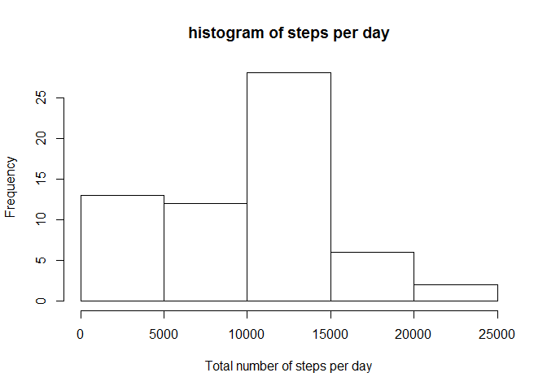
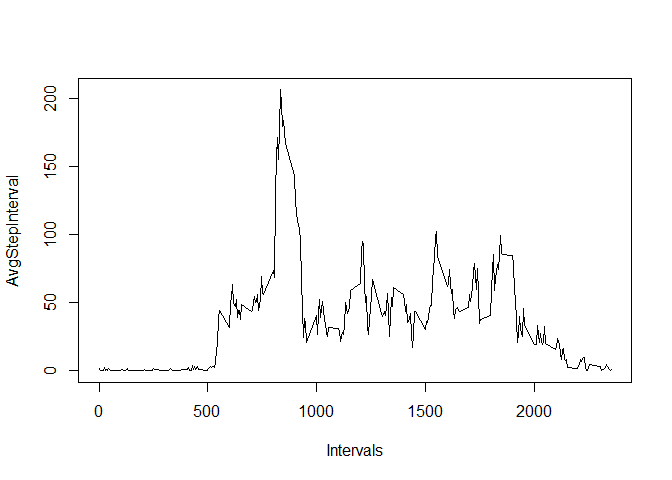
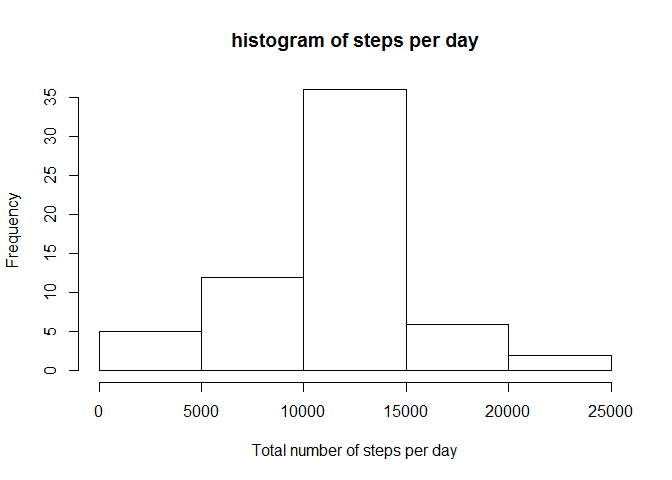
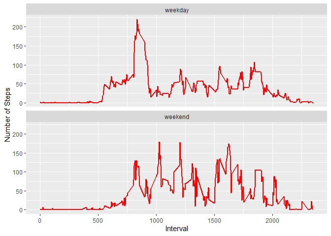

Peer-graded Assignment: Course Project 1
========================================

Code for reading in the dataset and/or processing the data
----------------------------------------------------------

    echo = TRUE
    URL <- "https://d396qusza40orc.cloudfront.net/repdata%2Fdata%2Factivity.zip"
    temp <- tempfile()
    download.file(URL,temp)
    data <- read.csv(unz(temp, "activity.csv"))
    unlink(temp)

Histogram of the total number of steps taken each day
-----------------------------------------------------

    Sum1 <- tapply(data$steps, data$date, sum, na.rm=TRUE)
    hist(Sum1, xlab = "Total number of steps per day", main = "histogram of steps per day")

Mean and median number of steps taken each day
----------------------------------------------

    Mean1 <- mean(Sum1)
    Mean1

    ## [1] 9354.23

    Median1 <- median(Sum1)
    Median1

    ## [1] 10395

Time series plot of the average number of steps taken
-----------------------------------------------------

    AvgStepInterval <- tapply(data$steps, data$interval, mean, na.rm=T)

    plot(AvgStepInterval ~ unique(data$interval), type="l", xlab = "Intervals")

The 5-minute interval that, on average, contains the maximum number of steps
----------------------------------------------------------------------------

    AvgStepInterval[which.max(AvgStepInterval)]

    ##      835 
    ## 206.1698

Code to describe and show a strategy for inputing missing data
--------------------------------------------------------------

    sum(is.na(data))

    ## [1] 2304

    ASI <- as.data.frame(AvgStepInterval)
    ASI <-tibble::rownames_to_column(ASI, "test") 

    New <- data

    for (i in unique(New$interval)) {
      New$steps[is.na(New$steps) & New$interval == i] <- round(mean(New$steps[New$interval == i], na.rm = T))
    }

Histogram of the total number of steps taken each day after missing values are imputed
--------------------------------------------------------------------------------------

    Sum2 <- tapply(New$steps, New$date, sum)
    hist(Sum2, xlab = "Total number of steps per day", main = "histogram of steps per day")

Panel plot comparing the average number of steps taken per 5-minute interval across weekdays and weekends
---------------------------------------------------------------------------------------------------------

    date <- as.Date(New$date)
    weekdayType <- ifelse(weekdays(date) %in% c("Satuday", "Sunday"),"weekend", "weekday")

    New <- cbind(New,weekdayType)

    StepsWeekday <- aggregate(steps ~ interval+weekdayType, data = New, FUN = mean)

    library(ggplot2)
    ggplot(StepsWeekday, aes(x = interval, y = steps)) + 
      geom_line(col = "red", size = 1) + 
      facet_wrap(~ weekdayType, nrow=2, ncol=1) + 
      labs(x = "Interval", y = "Number of Steps")

All of the R code needed to reproduce the results (numbers, plots, etc.) in the report
--------------------------------------------------------------------------------------

    URL <- "https://d396qusza40orc.cloudfront.net/repdata%2Fdata%2Factivity.zip"
    temp <- tempfile()
    download.file(URL,temp)
    data <- read.csv(unz(temp, "activity.csv"))
    unlink(temp)

    Sum1 <- tapply(data$steps, data$date, sum, na.rm=TRUE)
    hist(Sum1, xlab = "Total number of steps per day", main = "histogram of steps per day")

    Mean1 <- mean(Sum1)
    Mean1

    ## [1] 9354.23

    Median1 <- median(Sum1)
    Median1

    ## [1] 10395

    AvgStepInterval <- tapply(data$steps, data$interval, mean, na.rm=T)

    plot(AvgStepInterval ~ unique(data$interval), type="l", xlab = "Intervals")

    AvgStepInterval[which.max(AvgStepInterval)]

    ##      835 
    ## 206.1698

    sum(is.na(data))

    ## [1] 2304

    ASI <- as.data.frame(AvgStepInterval)
    ASI <-tibble::rownames_to_column(ASI, "test") 

    New <- data

    for (i in unique(New$interval)) {
      New$steps[is.na(New$steps) & New$interval == i] <- round(mean(New$steps[New$interval == i], na.rm = T))
    }

    Sum2 <- tapply(New$steps, New$date, sum)
    hist(Sum2, xlab = "Total number of steps per day", main = "histogram of steps per day")

    Mean2 <- mean(Sum2)
    Mean2

    ## [1] 10765.64

    Median2 <- median(Sum2)
    Median2

    ## [1] 10762

    Mean2 - Mean1

    ## [1] 1411.41

    Median2 - Median1

    ## [1] 367

    date <- as.Date(New$date)
    weekdayType <- ifelse(weekdays(date) %in% c("Satuday", "Sunday"),"weekend", "weekday")

    New <- cbind(New,weekdayType)

    StepsWeekday <- aggregate(steps ~ interval+weekdayType, data = New, FUN = mean)

    library(ggplot2)
    ggplot(StepsWeekday, aes(x = interval, y = steps)) + 
      geom_line(col = "red", size = 1) + 
      facet_wrap(~ weekdayType, nrow=2, ncol=1) + 
      labs(x = "Interval", y = "Number of Steps")

